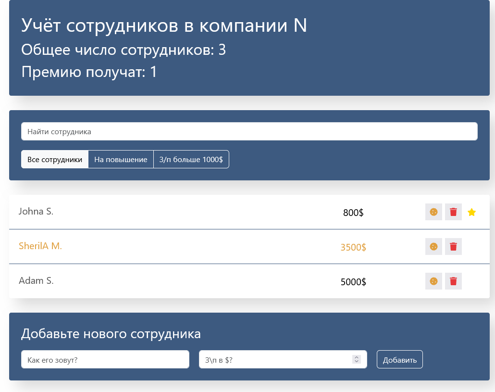

# 👨‍💼 Employee Management App

## 📌 Overview
A React-based application for managing employees within a company.

The app allows users to add, remove, search and filter employees, as well as manage bonuses and promotion status through interactive UI elements.

## 🚀 Demo
GitHub Pages Employee Management App: [Employees](https://aliangrey.github.io/employees/)

---

### 📸 Preview


---

## ✨ Features

- 👥 Display total number of employees  
- 💰 Count employees eligible for bonuses  
- 🔍 Live search (case-sensitive)  
- 🎯 Filtering:
  - All employees  
  - Employees for promotion  
  - Employees with salary > $1000  

- ⭐ Mark employee for promotion  
- 🍪 Assign bonus (highlight employee)  
- ❌ Delete employees  
- ➕ Add new employees via form  
- ✅ Form validation (salary must be a number)  
- ⚡ Instant UI updates without page reload  

---

## 🛠 Tech Stack

- React  
- JavaScript (ES6+)  
- CSS / SCSS  

---

## ⚛️ React Concepts Used

- Class components  
- Functional components  
- State management (`this.state`)  
- Event handling  
- Conditional rendering  
- Lifting state up  

---

## 🧠 Data Structure

Employees are stored as an array of objects:

```js id="emp-data"
{
  name: string,
  salary: number,
  increase: boolean, // bonus
  rise: boolean,     // promotion
  id: number
}
```
📂 Project Structure
```
public/
  index.html

src/
  components/
    app/
    app-filter/
    app-info/
    employees-add-form/
    employees-list/
    employees-list-item/
    search-panel/

  index.js
```
---

## 🎯 Functionality Details

🔍 Search
- Real-time filtering while typing
- Case-sensitive search

🎯 Filters
- By promotion status
- By salary threshold

⚡ UI Interactions
- Click on name → mark for promotion
- Click on cookie → assign bonus
- Visual highlighting for selected states

---

## 🎯 Purpose

This project was created to practice:<br>

React fundamentals<br>
Working with state and events<br>
Building interactive UI<br>
Form handling and validation<br>
Component-based architecture<br>

---

## ⚙️ Installation
```bash
git clone https://github.com/AlianGrey/employees.git
cd employees
npm install
```
▶️ Run locally
```bash
npm start
```

---

## 📬 Contact
- GitHub: [AlianGrey](https://github.com/AlianGrey)
- LinkedIn: [LinkedIn Profile](https://www.linkedin.com/in/kostrikinaelena/)
- Email: ek371117@gmail.com